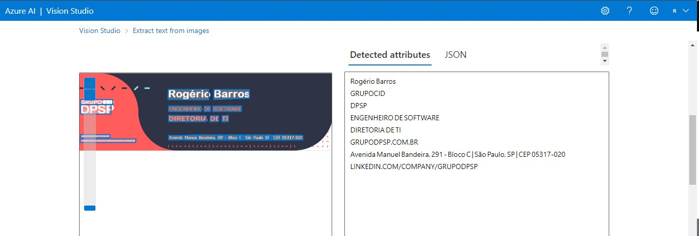

# dio-lab-vision-services

O Azure Custom Vision é uma ferramenta poderosa que permite criar modelos de visão computacional personalizados com facilidade, sem a necessidade de experiência extensiva em aprendizado de máquina. Aqui estão alguns insights e possibilidades de uso do Azure Custom Vision Studio:

1. **Classificação de Imagens**:
   - Identificação de produtos: Você pode treinar um modelo para reconhecer diferentes produtos em imagens, útil para categorização de inventário ou análise de prateleira em varejo.
   - Classificação de documentos: Automatize a classificação de documentos com base em seu conteúdo visual, como categorizar faturas, contratos ou formulários.

2. **Detecção de Objetos**:
   - Contagem de objetos: Por exemplo, contar o número de carros em uma imagem de tráfego para análise de fluxo.
   - Rastreamento de objetos: Acompanhe a movimentação de objetos em tempo real, como na vigilância de segurança ou monitoramento de tráfego.

3. **Segmentação de Imagens**:
   - Identificação de áreas de interesse: Por exemplo, segmentar imagens médicas para identificar regiões de interesse em radiografias ou ressonâncias magnéticas.
   - Reconhecimento de terreno: Segmentar imagens de terrenos para identificar características geográficas, como florestas, rios ou edifícios.

4. **Adicione legendas às Imagens**:
   - Descrevendo o conteúdo da imagem.
   
   1. Entre Azure AI Vision Studio
   2. Procure por Image analysis
   3. Depois por Add captions to images
   4. Marque a opção Try it out
   5. Faça o upload da imagem desejada
   6. Verifique o resultado

5. **Análise de Sentimentos em Imagens**:
   - Analise expressões faciais: Detecte emoções em rostos humanos em imagens, útil para análise de feedback do cliente ou detecção de estados emocionais em análises de vídeo.

6. **Reconhecimento Óptico de Caracteres (OCR)**:
   - Extração de texto: Extrair texto de imagens de documentos, como recibos, cartões de visita ou placas de identificação.
   
   1. Entre Azure AI Vision Studio
   2. Procure por Optical character recognition
   3. Depois por Extract text from images
   4. Marque a opção Try it out
   5. Faça o upload da imagem desejada
   6. Verifique o resultado

7. **Análise de Imagens Médicas**:
   - Diagnóstico assistido por computador: Auxilie médicos na interpretação de imagens médicas, como raios-X, ressonâncias magnéticas e tomografias computadorizadas.
   - Identificação de doenças de plantas: Detecte doenças em plantas a partir de imagens de folhas, ajudando na agricultura de precisão e na gestão de cultivos.

8. **Controle de Qualidade**:
   - Inspeção visual automatizada: Verifique a qualidade de produtos em linha de produção, identificando defeitos visuais em itens fabricados.

Essas são apenas algumas das possibilidades de uso do Azure Custom Vision. A ferramenta é altamente versátil e pode ser aplicada em uma ampla gama de cenários, desde automação industrial até soluções de varejo e saúde.
